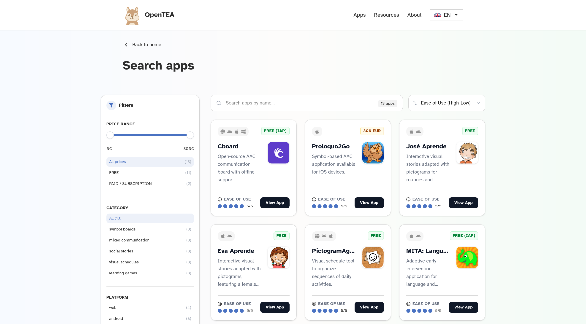
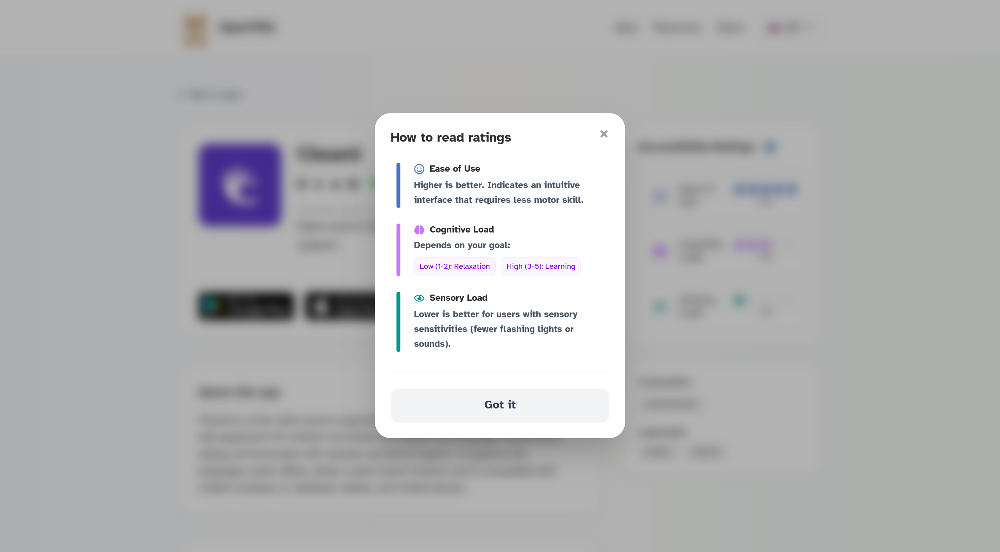

     [](https://ko-fi.com/opentea)

# 🐿️ OpenTEA


OpenTEA is a community-driven platform dedicated to curating, rating and categorizing applications that assist individuals with Autism Spectrum Disorder (ASD/TEA) and other neurodivergent conditions.

Our goal is to help families, therapists and users find the right digital tools by focusing on accessibility metrics like sensory load, cognitive load and ease of use.




## Evaluation criteria

Choosing the right assistive tool is a personal journey. To help you make informed decisions, we evaluate every application in our directory based on three core accessibility pillars.

| Criteria | What it measures | Goal |
| --- | --- | --- |
| **Ease of Use** | Interface intuitiveness and motor skill requirements. | **Higher is better:** Seeking smooth, accessible navigation. |
| **Cognitive Load** | How much mental processing is required to use the app. | **Goal-dependent:** Low (1-2) for relaxation, High (3-5) for active learning. |
| **Sensory Load** | Visual stimuli, sound effects, and overall sensory intensity. | **Lower is better:** Ideal for users with sensory sensitivities. |



## Categories & Classification

We categorize our apps to help you find the perfect match for specific communication or learning needs.

* **Symbol Boards:** Flexible grids for building sentences and expressing needs.
* **Mixed Communication:** Hybrid tools that combine symbols, text, and media.
* **Social Stories:** Apps that model social interactions and behaviors through narrative.
* **Visual Schedules:** Tools to help manage daily routines, reducing anxiety through predictability.
* **Learning Games:** Engaging activities designed to reinforce cognitive and language skills.

> **Inspiration:** Our classification framework is heavily inspired by [CALLScotland](https://www.callscotland.org.uk/downloads/posters-and-leaflets/ipad-apps-for-complex-communication-support-needs/) poster.


## 🚀 Getting started

### Prerequisites

* **Node.js 20+**
* **Docker Desktop** (Required to run the local database)
* **Supabase CLI** (For database management)

### 1. Set up the project

Clone the repository and install the dependencies:

```bash
git clone https://github.com/opentea-org/OpenTEA.git
cd OpenTEA
npm install
```

### 2. Local database setup

We use Supabase locally to keep everything synchronized.

1. Run the local environment: `supabase start`
2. Populate the database: `supabase db reset`
3. Check your local credentials with `supabase status` to configure your environment.

**Detailed instructions:** Please check the [Supabase instructions](/supabase/README.md) for full details on how to manage the database and environment variables.

### 3. Environment variables

Create a `.env` file in the root directory. Based on your `supabase status` output, it should look like this:

```env
NEXT_PUBLIC_SUPABASE_URL=http://127.0.0.1:54321
NEXT_PUBLIC_SUPABASE_ANON_KEY=[YOUR_S3_SECRET_KEY]
```

### 4. Start the app

```bash
npm run dev
```

Open http://localhost:3000 in your browser.


## 🌟 How to contribute

We welcome all kinds of contributions! You don't need to be a developer to help OpenTEA grow.

### If you are not a developer (non-code contributions)

We value your knowledge and feedback just as much as code. You can help by:

* **Suggesting new apps:** Know an app that should be in our browser? Open an **[Issue](https://github.com/opentea-org/OpenTEA/issues)** using the "App Request" template.
* **Reporting bugs or ideas:** If you find something broken or have an idea to improve the user experience, please **[open an issue](https://github.com/opentea-org/OpenTEA/issues/new)**. Just explain what you found and how we can make it better!
* **Proofreading:** Help us verify our translations to ensure they are natural and inclusive.

### If you are a developer

If you want to contribute with code, please follow these steps:

1. **Fork the project.**
2. **Create your feature branch:** `git checkout -b feature/AmazingFeature`
3. **Commit your changes:** `git commit -m 'Add some AmazingFeature'`
4. **Push to the branch:** `git push origin feature/AmazingFeature`
5. **Open a Pull Request:** Explain what your code does, and we will review it as soon as possible.

## License

Distributed under the MIT License. See `LICENSE` for more information.
