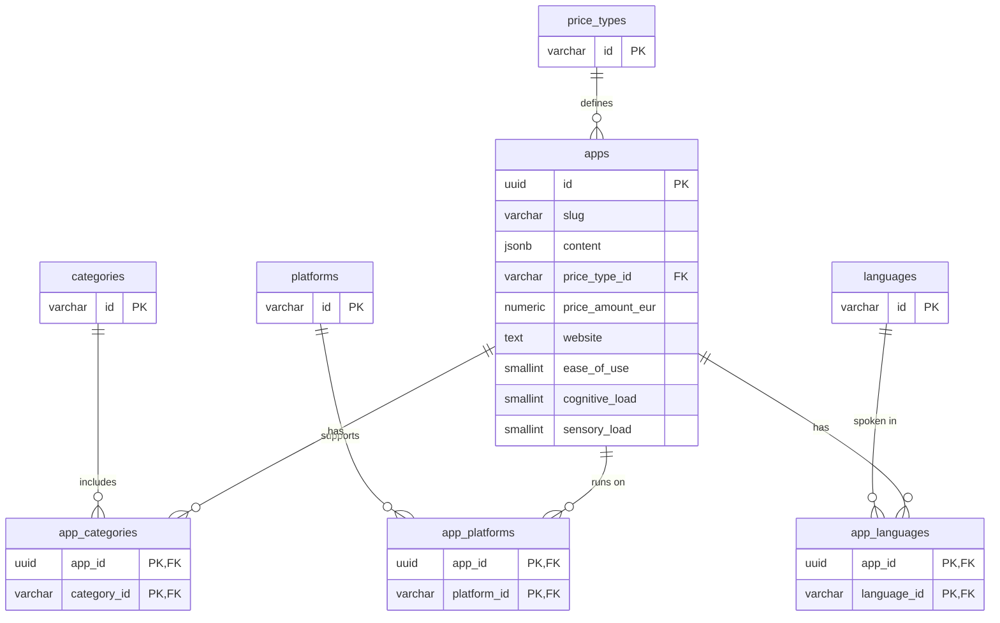

# Local Supabase Database

This project uses the [Supabase CLI](https://supabase.com/docs/guides/cli) to manage the local development environment.

## Quick start commands

The most fundamental commands you will use during development to manage the database lifecycle:

### 1. Start the environment
To spin up the Docker containers and the local Supabase API, we use a custom NPM script for convenience:

```bash
npm run db:start
```

*(Alternatively, you can run `npx supabase start` directly).*

### 2. Reset the database (Schema + Seed)

If you have modified the schema (migrations) or need a clean slate with fresh initial data, apply the changes with:

```bash
npx supabase db reset
```

*This command completely wipes the local database, applies all migrations from scratch, and re-populates it using your `seed.sql` file.*

> **Note on seeding:** The `seed.sql` file is automatically generated by aggregating the contents of the `/seeds` folder. Ensure your data scripts are correctly placed there before running a reset.

### 3. View local credentials

To configure your `.env` file, run the following command to retrieve your local project details:

```bash
npx supabase status
```

**Required environment variables:**
Configure your `.env` file with these values:

* `NEXT_PUBLIC_SUPABASE_URL=http://127.0.0.1:54321`
* `NEXT_PUBLIC_SUPABASE_ANON_KEY=[YOUR_ANON_KEY]` (Obtained via the status command)

### 4. Stop the environment

To safely stop the containers without deleting your local data:

```bash
npx supabase stop
```


## Development workflow & deployment

It is important to understand the relationship between your local environment and the Supabase Cloud instance:

* **Local vs. Cloud:** Changes made to your local database are **not** automatically reflected in the production (Cloud) database. Your local environment is strictly for development and testing purposes.
* **Proposing changes:** If you need to modify the database schema (e.g., adding tables, columns, or indexes) or update seed data, you **must** do so by creating migration files and updating the scripts in the `/seeds` folder.
* **Pull Requests:** Once your local changes are verified, include these migration and seed files in your Pull Request. Upon merging into the main branch, these changes will be applied to the production database via our deployment pipeline.


## Database architecture

The database is designed with a normalized relational schema to ensure data integrity and flexibility.

### Schema overview

1. **Lookup tables (Catalogs):** `categories`, `platforms`, `price_types`, and `languages`. These tables act as strict dictionaries (using string IDs) to prevent typos and ensure consistency across the application.
2. **Main table:** `apps`. The core table containing the primary information for each application (slug, pricing, store links, and accessibility ratings). Notice that localized or highly flexible content is stored in a `jsonb` column (`content`).
3. **Junction Tables (Many-to-Many):** `app_categories`, `app_platforms`, and `app_languages`. Since an app can be available in multiple languages, on multiple platforms, and belong to multiple categories, these tables link the `apps` table to the catalog tables.
4. **Security (RLS):** Row Level Security (RLS) is enabled on all tables. Currently, all tables have a policy allowing **public read access** (`select using (true)`), while writes and updates are restricted to authenticated internal roles.

### Entity-relationship diagram

Below is the Mermaid diagram representing the database schema and its relationships:




## File structure

* `/migrations`: Defines the database structure (tables, relationships, constraints, triggers).
* `/seeds`: Contains individual SQL files for catalog data and mock apps.
* `seed.sql`: The primary seed file. It is auto-generated from the contents of the `/seeds` folder to ensure the project is functional immediately upon setup.

